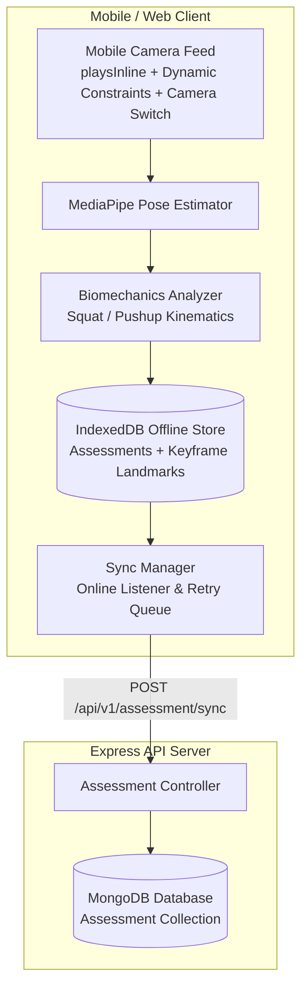

# Mobile Camera Fix & Offline-First MediaPipe Storage (IndexedDB ➔ MongoDB)

Implement reliable mobile camera access for MediaPipe pose estimation and build an offline-first storage engine that saves kinematics/landmark data into IndexedDB locally and syncs to MongoDB whenever online.

## User Review Required

> [!IMPORTANT]
> **Mobile Browser Secure Context Requirement**:
> Mobile browsers (iOS Safari, Chrome for Android) strictly enforce that `navigator.mediaDevices.getUserMedia` is only available in **Secure Contexts** (`https://` or `localhost`). When testing from a mobile phone on your local Wi-Fi network (e.g., `http://192.168.x.x:3000`), the app will display a clear notification indicating HTTPS or a secure tunnel (e.g., ngrok or Vite basicSsl) is required.

---

## Architecture & Data Flow

---

## Proposed Changes

### 1. Mobile Camera Resilience & Flip Support

#### [MODIFY] [CameraView.tsx](file:///d:/hackathon/sih25073/sih25073/client/src/components/CameraView.tsx)
- Implement tiered constraint resolution fallback (`1280x720` ➔ `640x480` ➔ permissive `{ video: true }`).
- Add toggle for Front (`user`) and Back (`environment`) camera switching for mobile phone users.
- Add iOS Safari video compatibility attributes (`playsInline`, `autoPlay`, `muted`).
- Provide secure context error notification when loaded over plain HTTP on LAN.

#### [MODIFY] [Assessment.tsx](file:///d:/hackathon/sih25073/sih25073/client/src/pages/Assessment.tsx)
- Replace `@mediapipe/camera_utils` `Camera` loop with native `requestAnimationFrame` / `getUserMedia` stream loop to eliminate mobile portrait orientation crashes.
- Integrate camera flip toggle button and offline sync badge into the assessment UI.
- Record sampled landmark keypoints during assessment and save automatically to `IndexedDB`.

---

### 2. Client Offline Storage & Sync Engine

#### [MODIFY] [indexedDB.ts](file:///d:/hackathon/sih25073/sih25073/client/src/storage/indexedDB.ts)
- Upgrade schema to support detailed assessment sessions, kinematic metrics (angles, cadence, depth), and sampled landmark keypoints.
- Add indexes on `synced` and `createdAt` for fast sync queue querying.
- Add `getUnsyncedAssessments()`, `markAssessmentSynced()`, and `deleteAssessment()` helper methods.

#### [NEW] [syncManager.ts](file:///d:/hackathon/sih25073/sih25073/client/src/services/syncManager.ts)
- Background listener for `online` / `offline` browser events.
- Batch processor that uploads pending IndexedDB records to the backend MongoDB endpoint.
- Emits sync state changes (pending items count, sync status, network status) for UI reactivity.

#### [MODIFY] [api.ts](file:///d:/hackathon/sih25073/sih25073/client/src/services/api.ts)
- Add API methods `syncAssessment()` and `batchSyncAssessments()` to send local sessions to MongoDB.

---

### 3. Backend MongoDB Model, Controller & Routes

#### [NEW] [assessment.model.js](file:///d:/hackathon/sih25073/sih25073/backend/src/model/assessment.model.js)
- Mongoose schema for assessments containing:
  - `userId` (optional / authenticated reference)
  - `localId` (client IndexedDB UUID to ensure idempotency)
  - `exerciseType` (`squat`, `pushup`)
  - `scores` (`totalScore`, `formAccuracy`, `depthScore`, `cadenceScore`, `symmetryScore`, `grade`)
  - `reps` (`total`, `valid`)
  - `metrics` (`durationSeconds`, `caloriesBurned`, `avgAngle`, `minAngle`, `maxAngle`)
  - `landmarksSample` (array of landmark keypoints for rep inflection points)
  - `clientTimestamp` & `syncedAt`

#### [NEW] [assessment.controller.js](file:///d:/hackathon/sih25073/sih25073/backend/src/controller/assessment.controller.js)
- Controller handling `syncAssessment`, `batchSync`, and `getUserAssessments` with duplicate-safe upsert on `localId`.

#### [NEW] [assessment.route.js](file:///d:/hackathon/sih25073/sih25073/backend/src/routes/assessment.route.js)
- Express router exposing:
  - `POST /api/v1/assessment/sync`
  - `POST /api/v1/assessment/batch-sync`
  - `GET /api/v1/assessment/history`

#### [MODIFY] [api.js](file:///d:/hackathon/sih25073/sih25073/backend/src/routes/api.js)
- Mount `/assessment` router to `/api/v1/assessment`.

---

## Verification Plan

### Automated / Syntax Verification
- TypeScript build check on client: `npm run build` in `client`.
- Node syntax check on backend: verify Mongoose models and Express routes load without error.

### Manual Verification
1. **Camera Test**:
   - Open app on desktop and mobile viewport.
   - Verify camera switches between front and rear cameras.
   - Verify MediaPipe skeleton renders smoothly on video feed.
2. **Offline-First & Sync Test**:
   - Complete an assessment with network disconnected (Browser DevTools -> Offline mode).
   - Verify data is saved in IndexedDB with `synced: false`.
   - Reconnect network (Browser DevTools -> Online mode).
   - Verify Sync Manager automatically detects connectivity, sends data to MongoDB, and updates `synced: true`.
